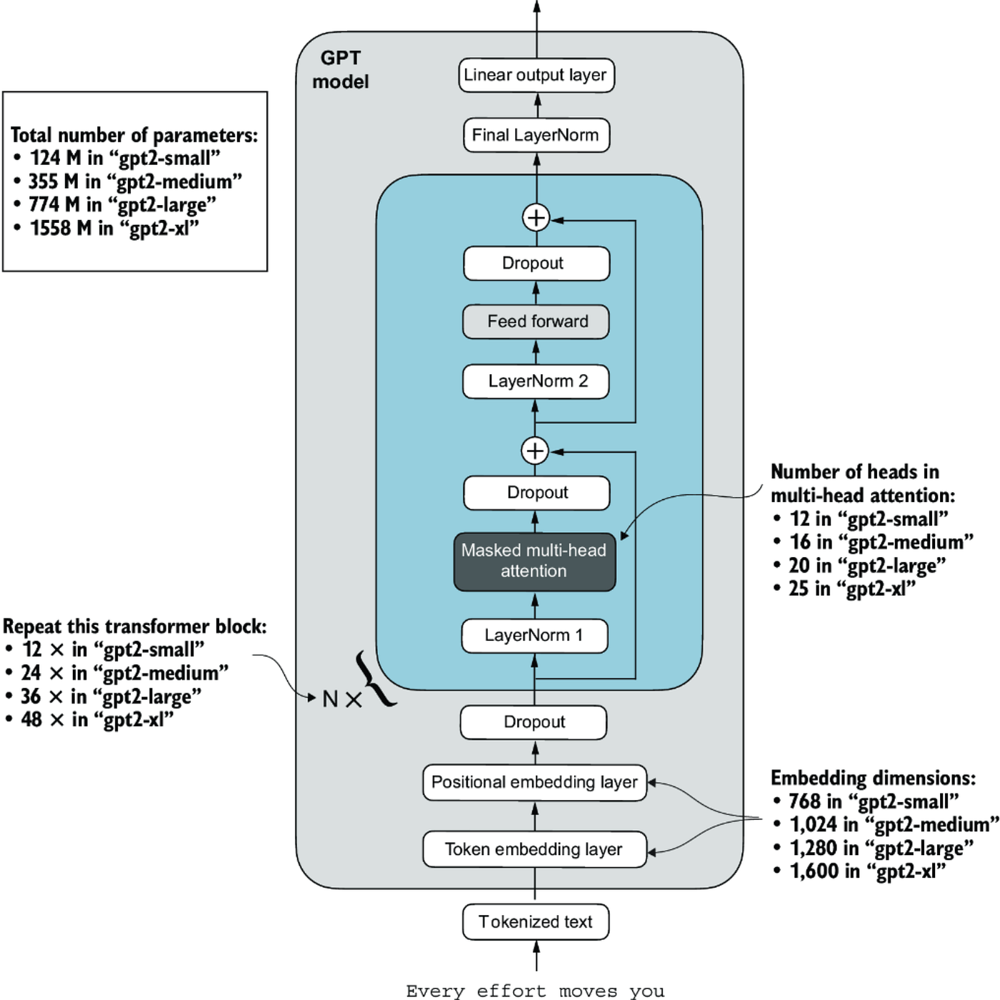

# Coding Base LLM 🚀

A minimal yet modular implementation of a **GPT-style Transformer Language Model** built from scratch using **PyTorch**.  
This project is designed for learning and experimentation, making it easy to understand the inner workings of LLMs like **GPT-2**.


## 📌 Features
- Implementation of **Transformer blocks** (Multi-Head Attention, Feed-Forward, LayerNorm, etc.)
- **Tokenizer integration** with customizable vocab
- Modular **Trainer** class with training/validation loops
- Support for **callbacks** (logging, checkpoint saving, early stopping)
- Configurable model parameters via `configs/`
- Scripts for **training, evaluation, and text generation**
- Example **Jupyter notebook** for experimentation


## 📂 Project Structure

```
CODINGBASELLM/
├── configs/            # GPT Configurations
├── data/               # Datasets and preprocessing scripts
├── models/             # Transformer model implementations
├── scripts/            # Training, evaluation, and utility scripts
├── training/           # Training Utilities
├── notebooks/          # Jupyter notebooks for experiments
├── README.md           # Project documentation
└── requirements.txt    # Python dependencies
```

## Config Used
```
model:
  name: gpt2-small
  vocab_size: 50257
  n_layers: 12
  n_heads: 12
  d_model: 768
  dff: 3072
  dropout_rate: 0.1
  seq_len: 256     # 1024 in original GPT-2-small paper
  qkv_bias: false

training:
  batch_size: 32
  epochs: 10
  learning_rate: 3e-4
  optimizer: adamw
  weight_decay: 0.01
  gradient_clip: 1.0
  device: auto
  save_dir: checkpoints/gpt2_small

data:
  train_path: data/train.txt
  val_path: data/val.txt
  block_size: 1024

logging:
  log_interval: 100
  save_interval: 1000
  output_dir: outputs/gpt2_small

device: cuda
seed: 42
```


## Getting Started

1. Clone the repository:
    ```bash
    git clone https://github.com/Singhal1026/CodingBaseLLM.git
    cd CodingBaseLLM
    ```
2. Install dependencies:
    ```bash
    pip install -r requirements.txt
    ```
3. Explore the code and notebooks to get started.

## Transformer Architecture

 

